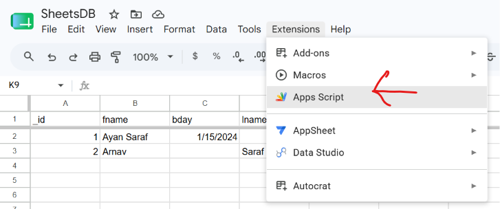
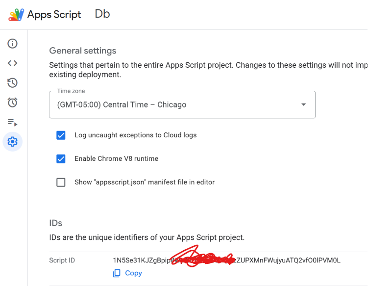

# SheetsDB
A project to turn google sheets in to a pretty functional database.

Wonderful resource to have a backend for small projects with virtually as much storage as you want
and it never turns off like Supabase.

## Setup
1. First thing that you will need to do is create a google sheet. Once created, you will need to 
go to the top bar where it shows Extensions, and then create a linked Apps Script.


2. Then, go to your [Apps Script user settings](https://script.google.com/home/usersettings) and 
turn on the Google Apps Script API.


3. Clone this repo using the following commands:
```
git clone https://github.com/Arnav-Saraf-Official/sheetsDB.git
cd sheetsDB
```

4. Set up Clasp by following these commands exactly as they are.
```
npm install @google/clasp -g
clasp login
```

5. Go to your Apps Script, open your project, and then go to the settings. From there, copy
the Script ID.


Now, create a copy of `.example.clasp.json` as `.clasp.json`, and paste in the Script ID in the
appropriate field.

Then run the following commands:
```
cd appsScript
clasp push
```

6. Now, go back to your dashboard, and create a deployment as a web app. After the deployment has been created, copy the deployment link. Then come back to your terminal and do `source ./deploy.sh` for mac/wsl/linux. (This is probably optional but I do it for good measure.)

7. Start up the demoSite to test your new database out. If you have python installed, you can run `python -m http.server 8080` to start a server on port 8080.

## Features
I mean yall can go look for yourself I am too lazy to list all of them right now

## Specialty
** It uses google sheets ** what more could you possibly need?
<small>(Yes, it can be edited visually in google sheets itself, just don't mess up the configuration sheets, and remember to update the configuration sheets as well)</small>
